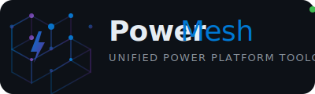

<picture>
  <source media="(prefers-color-scheme: dark)" srcset="assets/logo.svg">
  
</picture>

<p align="center">
  <a href="https://github.com/shouryavarma/power-platform-toolchain/releases/tag/v1.0.0"></a>
  <a href="LICENSE"></a>
  <a href="#"></a>
  <a href="#"></a>
  <a href="#"></a>
  <a href="CONTRIBUTING.md"></a>
</p>

<p align="center">
  <b>Say what you want in plain English.</b>
  PowerMesh routes your intent to the right Power Platform tool — MCP server, PAC CLI command, or plugin skill — automatically.
</p>

<p align="center">
  <a href="#installation"><kbd>⏬ Install</kbd></a>
  &nbsp;
  <a href="#quick-start"><kbd>🚀 Quick Start</kbd></a>
  &nbsp;
  <a href="#usage-examples"><kbd>📋 Examples</kbd></a>
  &nbsp;
  <a href="docs/ARCHITECTURE.md"><kbd>🏗️ Architecture</kbd></a>
</p>

```powershell
powershell -c "iex (irm https://raw.githubusercontent.com/shouryavarma/power-platform-toolchain/main/install.ps1)"
```

---

## Table of Contents

- [What is PowerMesh?](#what-is-powermesh)
- [Prerequisites](#prerequisites)
- [Installation](#installation)
- [Quick Start](#quick-start)
- [Usage Examples](#usage-examples)
- [Architecture](#architecture)
- [Sub-skills](#sub-skills)
- [MCP Servers](#mcp-servers)
- [Credential Provisioning](#credential-provisioning)
- [Testing](#testing)
- [Project Structure](#project-structure)
- [Contributing](#contributing)
- [License](#license)

---

## What is PowerMesh?

PowerMesh is a natural language interface for the Microsoft Power Platform ecosystem. It connects Claude Code to 7 MCP servers and 5 plugin sub-skills, giving you one conversational interface for:

- **Canvas Apps** — create, edit, compile, sync via Canvas Authoring MCP
- **Model-Driven Apps** — pages, forms, views via genpage skill
- **Power Pages** — sites, pages, deployment via create-site skill
- **Dataverse** — CRUD, schema, tables via PAC CLI or dataverse-mcp
- **PAC CLI** — 25+ command groups, zero setup required
- **Power Automate** — flow management via Flow Studio MCP
- **Power BI** — modeling and DAX via powerbi-modeling-mcp
- **Microsoft 365** — email, calendar, Graph via microsoft-365-mcp

**Key design principle:** Zero upfront configuration. Servers that need credentials prompt you on first use — you provide them once per session, never stored to disk.

---

## Prerequisites

| Requirement | Version | Why |
|------------|---------|-----|
| [Claude Code](https://claude.ai) | Latest | AI agent that runs PowerMesh skills |
| [PowerShell](https://learn.microsoft.com/en-us/powershell/) | 5.1+ | Installer and test runner |
| [PAC CLI](https://learn.microsoft.com/en-us/power-platform/developer/cli/introduction) | Latest | Power Platform command-line (install via `dotnet tool install --global Microsoft.PowerApps.CLI.Tool`) |
| [Node.js](https://nodejs.org/) | 18+ | Canvas Authoring MCP and MCP server runtime |
| [git](https://git-scm.com/) | Any | For development and cloning |

Optional but recommended:
- A Power Apps Studio browser tab (for Canvas Authoring MCP sync)
- A [Flow Studio](https://mcp.flowstudio.app) API key (for Power Automate)
- Azure AD app registration (for powerplatform-mcp and dataverse-mcp)

---

## Installation

### One-command remote install

Run this from any machine with PowerShell 5.1+:

```powershell
powershell -c "iex (irm https://raw.githubusercontent.com/shouryavarma/power-platform-toolchain/main/install.ps1)"
```

This will:
1. Create `~/.claude/plugins/powermesh/` with all plugin files
2. Register 5 sub-skills in `~/.agents/skills/powermesh*/`
3. Run the test suite to verify everything works
4. Print a summary

### Manual install

```powershell
# Clone the repo
git clone https://github.com/shouryavarma/power-platform-toolchain.git
cd power-platform-toolchain

# Run the installer
.\install.ps1
```

### Verify installation

```powershell
# Run the test suite
./scripts/test-runner.ps1

# Expected output: "Results: 8 passed, 0 failed, 7 skipped"
```

---

## Quick Start

Once installed, load the skill and start speaking naturally:

```
> skill("powermesh")
```

Then try these commands:

| You say | PowerMesh does |
|---------|---------------|
| "list solutions" | `pac solution list` — no setup needed |
| "what's my current environment" | `pac env who` |
| "export the Contoso solution" | `pac solution export --name Contoso --managed` |
| "create a canvas app for inventory tracking" | Loads canvas-app skill → plans screens → writes `.pa.yaml` → compiles → syncs to Studio |
| "add a Dataverse table for Customers" | `pac data create` or prompts for dataverse-mcp credentials |
| "show my Power Automate flows" | Prompts for Flow Studio API key → lists flows |
| "send an email to the team" | Prompts for device auth → sends via Microsoft Graph |
| "list records from the Account table" | `pac data list --table Account` |
| "create a code-first app for task tracking" | Scaffolds React/TS project → builds → deploys to Power Platform |
| "list my code apps" | `pac canvas list` |
| "download a code app" | `pac canvas download --name <name>` |

---

## Usage Examples

### Canvas App Creation

```
User:  "Create a canvas app for expense reporting"

Agent: "What screens do you need?"
User:  "Submit Expense, Pending Approvals, History"

Agent: → Writes 3 `.pa.yaml` files
       → Runs `compile_canvas` to validate
       → Runs `sync_canvas` to push to Studio
       → Returns the Studio session URL
```

### Solution Lifecycle

```
User:  "Export the Contoso solution"

Agent: → pac solution export --name Contoso --managed
       → Returns the exported .zip path

User:  "Clone it for source control"

Agent: → pac solution clone --name Contoso --output src/solutions/
       → Returns the cloned directory path
```

### Code-First Power App

```
User:  "Create a code-first app for task tracking"

Agent: "What data source?" → "SharePoint list called Tasks"
Agent: "What features?" → "View tasks, add new, mark complete"

Agent: → Scaffolds Vite + React + TypeScript project
       → Installs Power Apps SDK
       → Creates TaskList, AddTask, TaskDetail components
       → Connects to SharePoint Tasks list
       → Builds and deploys to Power Platform
       → Returns the app URL
```

```
User:  "List my code apps"

Agent: → pac canvas list
       → Returns table of app names, IDs, last modified
```

### On-demand Credential Provisioning

```
User:  "Show my Power Automate flows"

Agent: → Calls powerautomate-mcp → error: "FLOWSTUDIO_API_KEY not set"
       → "I need your Flow Studio API key. Get one at https://mcp.flowstudio.app"
User:  "My key is pp-flow-abc123..."

Agent: → Sets $env:FLOWSTUDIO_API_KEY = "pp-flow-abc123..."
       → Calls powerautomate-mcp → success
       → Returns the list of flows
```

---

## Architecture

```
                    ┌───────────────────────┐
                    │    Your Prompt         │
                    │  (plain English)       │
                    └──────────┬────────────┘
                               │
                               ▼
                    ┌───────────────────────┐
                    │  PowerMesh Intent     │
                    │  Router (SKILL.md)    │
                    └──┬───┬───┬───┬───┬───┘
                       │   │   │   │   │
          ┌────────────┘   │   │   │   └────────────┐
          ▼                ▼   ▼   ▼                ▼
   ┌────────────┐   ┌────────────┐   ┌──────────────────┐
   │  PAC CLI   │   │ Sub-skills │   │  MCP Servers     │
    │  (zero-env)│   │ (5 skills) │   │  (5 ready/block) │
   └────────────┘   └────────────┘   └──────────────────┘
          │                │                  │
          ▼                ▼                  ▼
   ┌────────────┐   ┌────────────┐   ┌──────────────────┐
   │ pac auth   │   │ Canvas App │   │ powerplatform-mcp│
   │ pac soln   │   │ Dataverse  │   │ dataverse-mcp    │
   │ pac env    │   │ PAC CLI    │   │ m365-mcp         │
   │ pac data   │   │ MCP Bridge │   │ flowstudio-mcp   │
   └────────────┘   └────────────┘   └──────────────────┘
```

**Three routing layers:**

1. **PAC CLI** (Layer 1) — Zero-setup workhorse. 25+ command groups for auth, solutions, data, environments, plugins, connectors. Always available.

2. **Sub-skills** (Layer 2) — Domain-specific agents that handle complex workflows (canvas app creation, Dataverse CRUD, credential provisioning).

3. **MCP Servers** (Layer 3) — Specialized servers for deep Power Platform integration. Some ready immediately (pac-cli MCP, canvas-authoring MCP), others prompt for credentials on first use.

---

## Sub-skills

All sub-skills are auto-installed to `~/.agents/skills/powermesh-*/` and loadable by name.

| Skill | Purpose | Load command |
|-------|---------|-------------|
| `powermesh` | Main intent router (this skill) | `skill("powermesh")` |
| `powermesh-canvas-app` | Canvas App CREATE/EDIT workflows | `skill("powermesh-canvas-app")` |
| `powermesh-dataverse` | Dataverse CRUD via PAC CLI + MCP | `skill("powermesh-dataverse")` |
| `powermesh-pac-cli` | PAC CLI command cheat sheet | `skill("powermesh-pac-cli")` |
| `powermesh-mcp-bridge` | On-demand credential provisioning | `skill("powermesh-mcp-bridge")` |
| `powermesh-create-code-app` | Code-first Power Apps (React/TS) | `skill("powermesh-create-code-app")` |

Additionally, the installer copies 7 Microsoft-provided plugin skills to `~/.agents/skills/`:

| Skill | Purpose |
|-------|---------|
| `canvas-app` | Canvas App coauthoring (Microsoft) |
| `configure-canvas-mcp` | Canvas MCP setup |
| `add-data-source` | Add data sources to canvas apps |
| `genpage` | Model-driven app pages |
| `create-site` | Power Pages sites |
| `create-code-app` | Code-first Power Apps |
| `generate-mcp-app-ui` | MCP widget UI generation |

---

## MCP Servers

| Server | Status | Env Vars Required | Credential Prompt |
|--------|--------|-------------------|-------------------|
| `pac-cli` | ✅ Ready | None | Never |
| `canvas-authoring` | ✅ Ready | None | Never (need Studio tab open) |
| `powerbi-modeling-mcp` | ✅ Ready | None | Never |
| `powerplatform-mcp` | ⚠️ Blocked | 4 vars (URL, client ID, secret, tenant ID) | On first use |
| `dataverse-mcp` | ⚠️ Blocked | 2 vars (connection URL, tenant ID) | On first use |
| `microsoft-365-mcp` | ⚠️ Blocked | Device code flow | On first use |
| `powerautomate-mcp` | ⚠️ Blocked | 1 var (Flow Studio API key) | On first use |

### Status details

- **Ready** — Works immediately. `pac-cli` MCP requires only the `pac` CLI to be installed. `canvas-authoring` requires a Power Apps Studio tab open in the browser.
- **Blocked** — Needs credentials. See [credential provisioning](#credential-provisioning) below. The skill will detect the block, ask for the credential, set it session-only, and retry automatically.

---

## Credential Provisioning

PowerMesh uses **on-demand credential provisioning**: credentials are never pre-configured or stored. When a blocked server is needed:

1. **Detect** — The MCP tool call returns an error indicating a missing environment variable
2. **Ask** — PowerMesh asks you for the required value, including where to obtain it
3. **Set** — The value is set as `$env:VAR_NAME = "value"` for the current session only
4. **Retry** — The tool call is retried and succeeds

### Provisioning matrix

| Server | Prompt | Where to get |
|--------|--------|-------------|
| `powerplatform-mcp` | "What's your Dataverse org URL, SPN client ID, client secret, and tenant ID?" | Azure AD app registration |
| `dataverse-mcp` | "What's your Dataverse org URL and tenant ID?" | Power Platform Admin Center |
| `microsoft-365-mcp` | "Open https://microsoft.com/devicelogin and enter the code: XXX" | Microsoft 365 admin |
| `powerautomate-mcp` | "What's your Flow Studio API key?" | https://mcp.flowstudio.app |

---

## Testing

PowerMesh includes a comprehensive test suite:

```powershell
# Run all tests
./scripts/test-runner.ps1

# Run a specific test by name
./scripts/test-runner.ps1 -Test "pac-solution-list"

# List all available tests
./scripts/test-runner.ps1 -List
```

### Test categories

- **PAC CLI documentation coverage** (4 tests) — Validates every command referenced in SKILL.md actually exists in the `pac` CLI help output
- **Credential provisioning flow** (4 tests) — Validates the on-demand credential workflow is documented for each blocked server
- **Sub-skill routing** (7 tests, non-critical) — Validates intent routing to sub-skills (requires runtime environment to fully execute)

All test results: **8 PASS, 0 FAIL, 7 SKIPPED** (skipped tests need a runtime environment with active MCP servers).

Test definitions: `tests/test-cases.yaml` (25 documented cases)
EvalView tests: `tests/evalview/` (E2E automation scenarios)

---

## Project Structure

```
power-platform-toolchain/
├── .gitignore                       # Git ignore rules
├── LICENSE                          # MIT license
├── README.md                        # This file
├── CHANGELOG.md                     # Version history
├── CONTRIBUTING.md                  # Contribution guide
│
├── SKILL.md                         # Main intent router (loaded by skill())
├── plugin.yaml                      # Plugin manifest (name, deps, hooks)
├── install.ps1                      # One-command installer
├── push-to-github.ps1               # GitHub push helper
│
├── shared/
│   └── shared-instructions.md       # Cross-cutting concerns (auth, errors, rate limits)
│
├── skills/
│   ├── canvas-app/SKILL.md          # Canvas App CREATE/EDIT builder
│   ├── dataverse/SKILL.md           # Dataverse CRUD via PAC CLI + MCP
│   ├── pac-cli/SKILL.md             # PAC CLI cheat sheet (25+ commands)
│   └── mcp-bridge/SKILL.md          # On-demand credential provisioning
│
├── scripts/
│   └── test-runner.ps1              # Test runner (15 test cases)
│
├── tests/
│   ├── test-cases.yaml              # 25 documented test cases
│   └── evalview/
│       └── canvas-app-create.yaml   # E2E test scenario
│
├── examples/
│   └── canvas-app-inventory.yaml    # Full session walkthrough
│
└── docs/
    ├── ARCHITECTURE.md              # Detailed architecture
    └── CREDENTIAL_PROVISIONING.md   # Full provisioning guide
```

---

## Contributing

Contributions are welcome! See [CONTRIBUTING.md](CONTRIBUTING.md) for guidelines.

**Quick start for contributors:**

```powershell
git clone https://github.com/shouryavarma/power-platform-toolchain.git
cd power-platform-toolchain
.\install.ps1        # local reinstall
.\scripts\test-runner.ps1   # verify
```

---

## License

[MIT](LICENSE) — Free to use, modify, and distribute.
